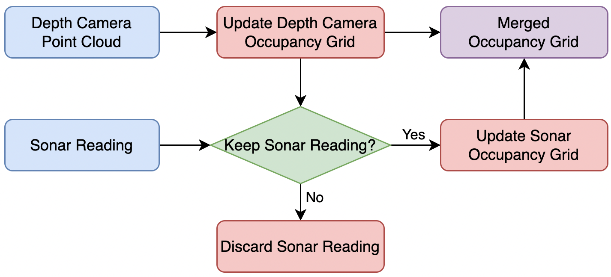
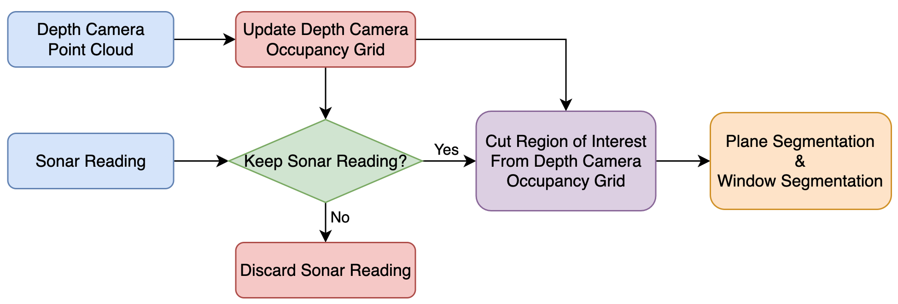
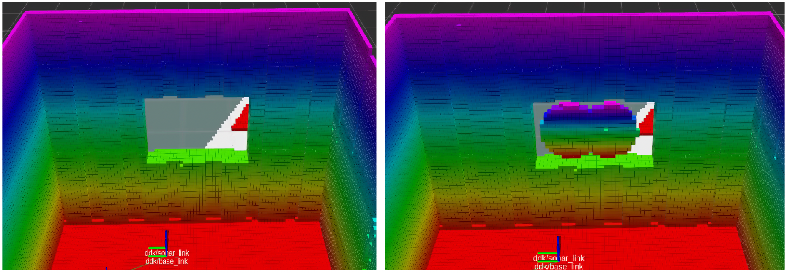
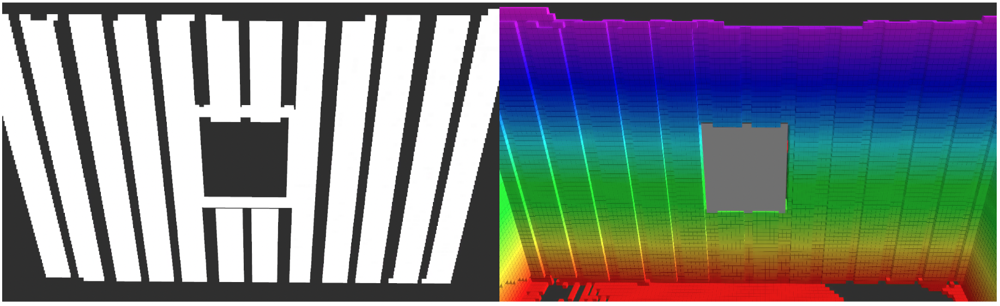

# Sensor Fusion of Depth Camera and Ultrasonic Sensor for Glass Detection

We investigate the challenge posed by glass windows, which are common components in indoor environments, as they are not detectable by depth cameras. In contrast, ultrasonic sensors emit high-pitched sound pulses that are reflected regardless of lighting conditions or object's optical properties. Therefore, we investigate the feasibility of integrating ultrasonic sensors as a secondary sensing modality to our current mapping stack. The outcomes of this independent study include the development of simulation environments in Gazebo to replicate indoor building with windows, the implementation of a sensor fusion mechanism for combining depth image and sonar data, and the design of a RANSAC-based approach for window segmentation in indoor exploration scenarios. These outcomes enable the robot to recognize glass as obstacles and identify potential window regions based on geometric characteristics. This study provides insights into potential benefits and limitations of sensor fusion of depth camera and ultrasonic sensor.

## Simulation Environment
We developed a collection of simulation environments in Gazebo, specifically designed to replicate the layouts of typical indoor building floor plans. An example of our simulation environments is presented under ```sonar_ddk/sample/world_with_glass.world```. Notice that the glass region has the collision volume but does not has a visual property. A sonar sensor urdf is shared under ```sonar_ddk/sample/sonar_sensor.urdf.xacro```.

## System Architecture
To maintain an accurate and comprehensive representation of the surrounding environment, we maintained two separate occupancy maps. The first occupancy map is created solely using depth camera data, which provides reliable and precise information about the environment. The second occupancy map is updated with sonar readings, which can detect objects that are not visible to the camera. We also propose a RANSAC-based approach for window segmentation. The method initially identifies the region of interest based on the discrepancy between the sonar reading and the depth-image-based occupancy map. Then, the potential location of the window is further determined by its geometric characteristics.

<p align="center">
  &nbsp; &nbsp;  
</p>

## Results
To demonstrate the effectiveness of our approach, we compare the occupancy map built solely using depth images with the occupancy map maintained by fusing depth images and sonar readings as shown in the picture below.
<p align="center"> </p>

Following figure shows an example of the segmented window area, which is marked in grey and framed by the colorful depth-camera-based occupancy grids. The left image displays all the inliers on the fitted largest plane. The right image depicts the occupancy map, with the window segmentation marked in grey.
<p align="center"> </p>

## Limitations
The limitations of the proposed approach include:
- The sonar readings are only reliable when the drone is very close to the window and facing it directly, limiting its use in scenarios where the drone cannot get close or has obstructed views.
- The RANSAC-based plane segmentation technique may struggle in real-life indoor settings with many obstacles, potentially leading to incorrect segmentation.
- The approach assumes that windows are surrounded by solid, camera-visible walls, which may not always be the case, especially with thin frames or large tilted windows like those in the PERCH meeting room.

## Submodules
- sonar_ddk: to be cloned onto the drone for reading sonar messages through UART and publish as rostopic for later use
- occ_grid: a occupancy grid library with occupancy updating based on raw depth image and raytracing algorithm
- sonar_occ_grid: a occupancy grid library with occupancy updating based on sonar range message and raytracing algorithm
- occ_fusion: fusing the sonar-based occupancy grid and depth image based occupancy grid

## Instructions for running

This repository is supposed to be run with the Kumar Robotics Exploration stack. For details on the installation of the Exploration stack, refer to ```Exploration_stack_installation.txt``` included in this repository.

- Navigate to "scripts" folder in ```ddk_sim_launch``` and run the ```demo_ddk.sh``` file
```
roscd ddk_sim_launch/scripts
./demo_ddk.sh
```

- After Gazeb and rviz are loaded, On another terminal, run 
```
roslaunch occ_fusion occ_fusion.launch
```
